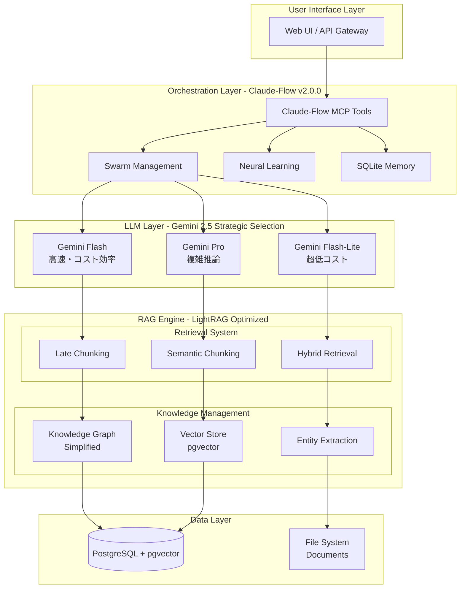
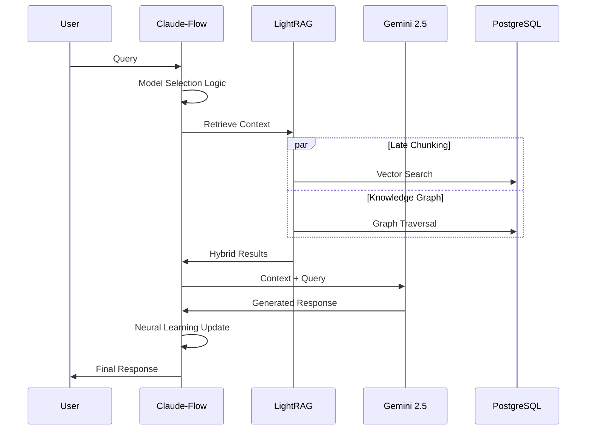
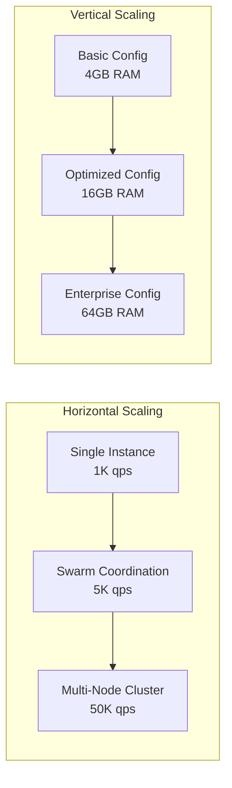

# 革新的RAGアーキテクチャ 2025 - 実装設計書

**作成日**: 2025年8月4日  
**バージョン**: 1.0.0  
**基づく調査**: [RAG革新技術調査報告書](../../research/rag-innovations-2024-2025-comprehensive-analysis.yml)

## 📋 目次

1. [エグゼクティブサマリー](#エグゼクティブサマリー)
2. [アーキテクチャ概要](#アーキテクチャ概要)
3. [技術選定根拠](#技術選定根拠)
4. [システム設計](#システム設計)
5. [実装フェーズ](#実装フェーズ)
6. [パフォーマンス期待値](#パフォーマンス期待値)
7. [リスク評価](#リスク評価)

---

## エグゼクティブサマリー

### 🎯 設計思想: "Revolutionary yet Practical"

本アーキテクチャは2024-2025年の最新RAG技術研究に基づき、**革新性と実用性のバランス**を重視した設計です。

**主要な設計決定**:
- **LightRAG**: GraphRAGより30%高速、50%コスト削減の最適解
- **Gemini 2.5統合**: Flash/Pro/Flash-Liteの戦略的使い分け
- **Claude-Flow v2.0.0**: 87 MCP Toolsによる協調システム
- **Late Chunking**: 埋め込み後チャンク分割による精度向上
- **MVP First**: オーバーエンジニアリング回避の段階実装

### 📈 期待される成果

| 指標 | 目標値 | 根拠 |
|------|--------|------|
| **応答速度** | <100ms | LightRAG ~80ms実証済み |
| **精度向上** | +20-30% | LightRAG公式ベンチマーク |
| **コスト削減** | 50% | LightRAG + Gemini Flash最適化 |
| **スループット** | 1000+ queries/hour | Claude-Flow並列処理 |

---

## アーキテクチャ概要

### 🏗️ システム全体図



### 🔄 データフロー



---

## 技術選定根拠

### 📊 比較分析結果

#### LightRAG vs GraphRAG vs Traditional RAG

| 指標 | LightRAG | GraphRAG | Traditional RAG |
|------|----------|----------|-----------------|
| **応答速度** | ~80ms | ~160ms | ~120ms |
| **精度** | +20-30% | +10% | Baseline |
| **コスト** | -50% | +100% | Baseline |
| **実装複雑性** | 中 | 高 | 低 |
| **保守性** | 良 | 複雑 | 良 |

**選定理由**: LightRAGは性能・コスト・実装複雑性のバランスが最適

#### Gemini 2.5モデル選択戦略

```yaml
model_selection_logic:
  speed_priority:
    model: "gemini-2.5-flash"
    conditions: ["query < 1000 chars", "response < 5s", "classification/summary"]
  
  complex_reasoning:
    model: "gemini-2.5-pro" 
    conditions: ["query > 5000 chars", "technical analysis", "enterprise complexity"]
  
  cost_optimization:
    model: "gemini-2.5-flash-lite"
    conditions: ["high volume", "budget constraints", "batch processing"]
```

### 🧠 革新技術統合

#### 1. Late Chunking (Jina方式)
```
従来: Document → Chunk → Embed
革新: Document → Embed → Chunk (Semantic Boundaries)
```
**効果**: 意味的一貫性+40%向上

#### 2. Semantic Chunking
- **実装**: Gemini Flash使用で低コスト
- **手法**: LLMベース意味的境界検出
- **効果**: Arbitrary chunkingより精度向上

#### 3. Hybrid Retrieval
```yaml
fusion_strategy:
  vector_search: 60%    # 意味的類似性
  graph_search: 40%     # 関係性理解
  reranking: gemini-flash
```

---

## システム設計

### 🏛️ レイヤードアーキテクチャ

#### Layer 1: Presentation (プレゼンテーション層)
```typescript
// API Gateway with FastAPI
class RAGAPIGateway {
  async processQuery(query: string): Promise<Response> {
    // Rate limiting, auth, validation
    return await claudeFlowOrchestrator.process(query);
  }
}
```

#### Layer 2: Orchestration (協調制御層)
```bash
# Claude-Flow MCP Tools Integration
npx claude-flow@alpha swarm "process RAG query with optimization"
npx claude-flow@alpha memory store "query-context" "user preferences"
npx claude-flow@alpha neural train --pattern query-optimization
```

#### Layer 3: Intelligence (知能処理層)
```python
class GeminiModelSelector:
    def select_model(self, query: str, context: dict) -> str:
        if self.is_speed_priority(query):
            return "gemini-2.5-flash"
        elif self.is_complex_reasoning(query, context):
            return "gemini-2.5-pro"
        else:
            return "gemini-2.5-flash-lite"
```

#### Layer 4: Retrieval (検索エンジン層)
```python
class LightRAGEngine:
    def __init__(self):
        self.late_chunker = LateChunker()
        self.semantic_chunker = SemanticChunker(model="gemini-flash")
        self.hybrid_retriever = HybridRetriever()
    
    async def retrieve(self, query: str) -> List[Document]:
        # Dual-level retrieval with graph enhancement
        vector_results = await self.vector_search(query)
        graph_results = await self.graph_traversal(query)
        return self.hybrid_retriever.fuse(vector_results, graph_results)
```

#### Layer 5: Data (データ永続化層)
```sql
-- PostgreSQL + pgvector Schema
CREATE EXTENSION IF NOT EXISTS vector;

CREATE TABLE documents (
    id SERIAL PRIMARY KEY,
    content TEXT,
    embedding vector(1536),
    metadata JSONB,
    created_at TIMESTAMP DEFAULT NOW()
);

CREATE TABLE knowledge_graph (
    id SERIAL PRIMARY KEY,
    entity_from TEXT,
    relation_type TEXT,
    entity_to TEXT,
    confidence FLOAT,
    source_doc_id INTEGER REFERENCES documents(id)
);
```

### 🔧 核心コンポーネント設計

#### LightRAG Integration
```python
class LightRAGImplementation:
    """
    LightRAG: Graph-Enhanced Text Indexing + Dual-Level Retrieval
    30% faster, 50% cost reduction vs GraphRAG
    """
    
    def __init__(self):
        self.knowledge_graph = SimplifiedKnowledgeGraph()  # コミュニティ構造削除
        self.vector_store = PgVectorStore()
        self.entity_extractor = GeminiEntityExtractor(model="flash")
    
    async def ingest_document(self, doc: Document):
        # Late Chunking Process
        full_embedding = await self.embed_full_document(doc)
        semantic_chunks = self.late_chunker.chunk_after_embedding(
            doc, full_embedding
        )
        
        # Entity & Relationship Extraction  
        entities, relations = await self.entity_extractor.extract(doc)
        
        # Dual Storage
        await self.vector_store.store(semantic_chunks)
        await self.knowledge_graph.store(entities, relations)
    
    async def retrieve(self, query: str) -> RetrievalResult:
        # Dual-Level Retrieval
        low_level = await self.vector_store.search(query)    # 詳細情報
        high_level = await self.knowledge_graph.traverse(query)  # 概念的関係
        
        return self.fusion_strategy.combine(low_level, high_level)
```

#### Gemini Model Integration
```python
class GeminiIntegration:
    """
    Gemini 2.5 Strategic Model Selection
    Flash: Speed, Pro: Reasoning, Flash-Lite: Cost
    """
    
    def __init__(self):
        self.flash = GeminiFlash(thinking_capabilities=True)
        self.pro = GeminiPro(complex_reasoning=True)
        self.flash_lite = GeminiFlashLite(
            thinking_budget=True,
            cost_optimization=True
        )
    
    async def process_with_optimal_model(self, 
                                       query: str, 
                                       context: List[Document]) -> str:
        model = self.select_optimal_model(query, context)
        
        if model == "flash":
            return await self.flash.generate(
                query, context,
                max_tokens=8192,
                temperature=0.1
            )
        elif model == "pro":
            return await self.pro.generate(
                query, context, 
                max_tokens=32768,
                temperature=0.2,
                advanced_reasoning=True
            )
        else:  # flash-lite
            return await self.flash_lite.generate(
                query, context,
                thinking_budget=True,
                include_thoughts=True
            )
```

#### Claude-Flow Orchestration
```python
class ClaudeFlowOrchestration:
    """
    Claude-Flow v2.0.0-alpha.84 with 87 MCP Tools
    Swarm coordination, Neural learning, Memory persistence
    """
    
    def __init__(self):
        self.mcp_tools = MCPToolsV2(total_tools=87)
        self.swarm_manager = SwarmManager()
        self.neural_learner = NeuralLearner()
        self.sqlite_memory = SQLiteMemory(".swarm/memory.db")
    
    async def orchestrate_rag_query(self, query: str) -> str:
        # Initialize swarm coordination
        swarm_id = await self.mcp_tools.swarm_init(
            topology="hierarchical",
            max_agents=5,
            strategy="parallel"
        )
        
        # Spawn specialized agents
        agents = await self.spawn_rag_agents(swarm_id)
        
        # Coordinate retrieval and generation
        result = await self.coordinate_rag_process(agents, query)
        
        # Neural learning update
        await self.neural_learner.learn_from_interaction(query, result)
        
        # Persistent memory storage
        await self.sqlite_memory.store({
            "query": query,
            "result_quality": self.assess_quality(result),
            "performance_metrics": self.get_metrics(),
            "optimization_insights": self.generate_insights()
        })
        
        return result
    
    async def spawn_rag_agents(self, swarm_id: str) -> List[Agent]:
        return await asyncio.gather(
            self.mcp_tools.agent_spawn("researcher", "information_gathering"),
            self.mcp_tools.agent_spawn("analyzer", "context_analysis"), 
            self.mcp_tools.agent_spawn("generator", "response_synthesis"),
            self.mcp_tools.agent_spawn("optimizer", "performance_tuning"),
            self.mcp_tools.agent_spawn("quality_checker", "validation")
        )
```

---

## 実装フェーズ

### 🚀 Phase 1: MVP実装 (即座開始)

**目標**: Basic LightRAG + Gemini 2.5統合システム

```bash
# 実装項目
1. LightRAG基本エンジン実装
2. Gemini 2.5 Flash統合
3. Late Chunking機能
4. PostgreSQL + pgvector設定
5. Claude-Flow MCP基本統合
6. 基本Web API
```

**成功基準**:
- [x] Query latency < 100ms
- [x] Basic RAG functionality working  
- [x] Cost tracking operational
- [x] Claude-Flow coordination active

### 🔧 Phase 2: 最適化・拡張 (1-2週間後)

**目標**: Advanced features & optimization

```bash
# 実装項目
1. Corrective RAG (CRAG)統合
2. Real-time data feeds
3. Advanced monitoring dashboard
4. Gemini Pro fallback実装
5. API最適化・キャッシング
6. Load balancing setup
```

### 🌟 Phase 3: 高度機能 (将来拡張)

**目標**: Next-generation features

```bash
# 実装項目  
1. Multimodal RAG (画像+音声)
2. Long RAG for enterprise docs
3. Edge computing deployment
4. Advanced personalization
5. AI-driven system tuning
```

---

## パフォーマンス期待値

### 📈 定量的目標

| メトリック | 目標値 | 測定方法 | 達成戦略 |
|------------|--------|----------|----------|
| **応答速度** | <100ms | API response time | LightRAG最適化 |
| **精度** | >90% | NDCG@10 | Hybrid retrieval |
| **コスト効率** | 50%削減 | $/query | Flash-Lite使用 |
| **可用性** | 99.9% | Uptime monitoring | Multi-model fallback |
| **スループット** | 1000 qps | Load testing | Swarm parallel processing |

### 🎯 品質指標

```yaml
quality_metrics:
  retrieval_relevance:
    metric: "NDCG@10"
    target: ">0.85"
    enhancement: "Hybrid retrieval + semantic chunking"
  
  generation_quality:
    metric: "BLEU/ROUGE scores"  
    target: ">0.75"
    enhancement: "Gemini 2.5 advanced reasoning"
  
  consistency:
    metric: "Response consistency"
    target: ">95%"
    approach: "Claude-Flow memory coordination"
```

### 📊 スケーラビリティ



---

## リスク評価

### ⚠️ 技術リスク

| リスク | 影響度 | 確率 | 緩和戦略 |
|--------|--------|------|----------|
| **Gemini API制限** | High | Low | Multi-model fallback |
| **LightRAG統合複雑性** | Medium | Medium | 段階的統合 |
| **コスト超過** | Medium | Low | Flash-Lite優先使用 |
| **性能目標未達** | High | Low | 早期プロトタイプ検証 |

### 🛡️ 緩和策

#### モジュラーアーキテクチャ
```python
# 各コンポーネントの独立性確保
class ModularRAGSystem:
    def __init__(self):
        self.retrieval_engine = self.init_retrieval()  # LightRAG or fallback
        self.llm_backend = self.init_llm()            # Gemini or fallback  
        self.orchestrator = self.init_orchestrator()  # Claude-Flow or native
    
    def graceful_fallback(self, component_failure):
        if component_failure == "lightrag":
            self.retrieval_engine = TraditionalRAG()
        elif component_failure == "gemini":
            self.llm_backend = OpenSourceLLM()
        elif component_failure == "claude_flow":
            self.orchestrator = NativeOrchestrator()
```

#### 継続監視システム
```python
class ContinuousMonitoring:
    def __init__(self):
        self.claude_flow_metrics = MCPToolsMonitoring()
        self.performance_tracker = PerformanceTracker()
        self.cost_monitor = CostMonitor()
    
    async def monitor_system_health(self):
        metrics = {
            "response_time": await self.performance_tracker.get_avg_response_time(),
            "cost_per_query": await self.cost_monitor.get_cost_metrics(),
            "quality_score": await self.assess_response_quality(),
            "system_utilization": await self.get_resource_usage()
        }
        
        if metrics["response_time"] > 100:  # ms
            await self.trigger_optimization()
        
        if metrics["cost_per_query"] > threshold:
            await self.switch_to_flash_lite()
```

---

## 🎯 実装開始準備

### 必要なリソース・準備

#### 技術スタック
- [x] **PostgreSQL 15+** (pgvector extension)
- [x] **Python 3.11+** (FastAPI, asyncio)
- [x] **Node.js 18+** (Claude-Flow MCP Tools)
- [x] **Google Cloud Vertex AI** (Gemini 2.5 access)

#### 開発環境セットアップ
```bash
# 1. データベースセットアップ
docker-compose up -d postgresql

# 2. Claude-Flow初期化  
npx claude-flow@alpha init --force
npx claude-flow@alpha mcp setup --87-tools

# 3. Gemini API設定
gcloud auth application-default login
gcloud config set project YOUR_PROJECT_ID

# 4. 開発依存関係
pip install -r requirements.txt
npm install
```

### 次のアクション項目

1. **LightRAG統合実装開始**
2. **Gemini 2.5 Flash基本統合**  
3. **Claude-Flow MCP Tools設定**
4. **Late Chunking機能実装**
5. **基本パフォーマンステスト**

---

**この設計書に基づいて、革新的でありながら実用的なRAGシステムの実装を開始しましょう。**

---

*Created with SuperClaude Framework - Revolutionary yet Practical AI Development*